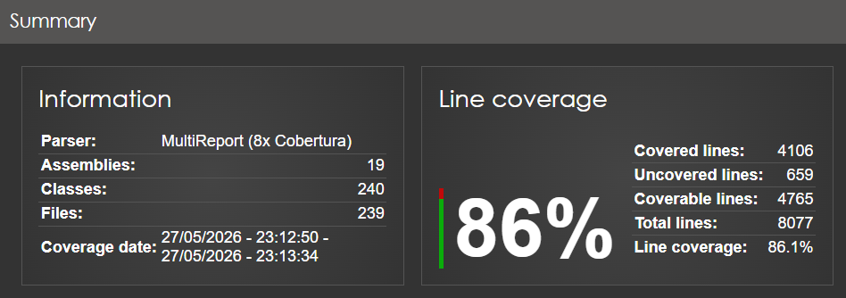
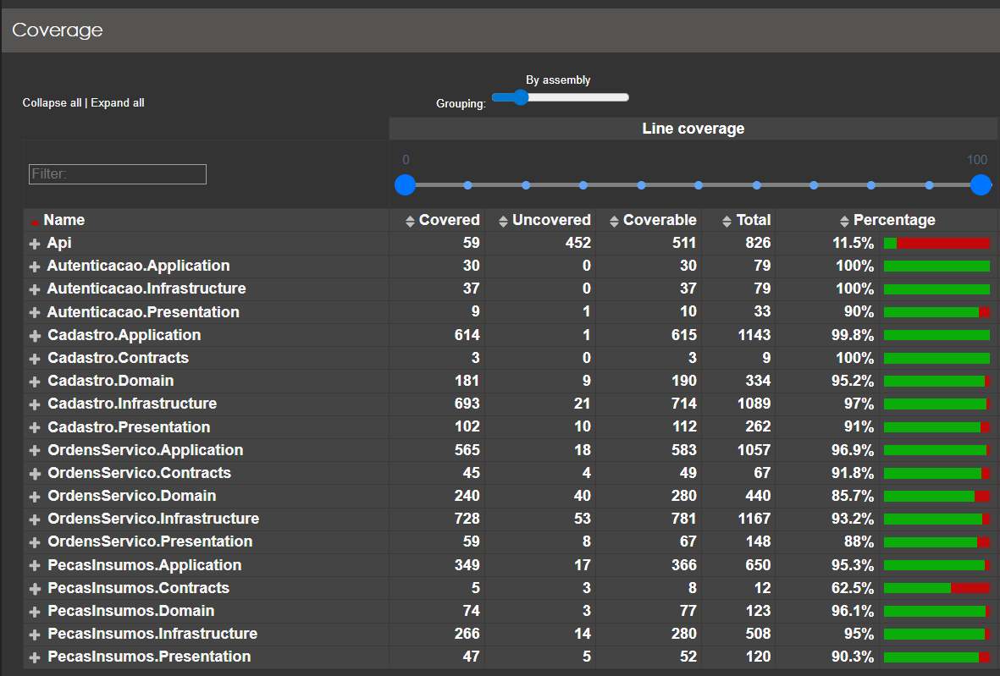

# Sistema de Oficina Mecânica

Back-end de um sistema integrado de atendimento e execução de serviços para oficina mecânica, desenvolvido como Tech Challenge da Fase 1 da pós-graduação em Arquitetura de Software (FIAP/SOAT).

---

## Sobre o Projeto

### O Desafio

O requisito do Tech Challenge era construir um back-end monolítico com DDD aplicado, APIs RESTful documentadas, autenticação JWT, validação de CPF/CNPJ e placa, cobertura de testes ≥ 80% nos domínios críticos, e orquestração via Docker.

### Objetivos Adicionais (além do requisito)

O projeto foi desenvolvido com foco em estudo aprofundado de arquitetura de software, incorporando deliberadamente práticas que vão além do MVP exigido:

- **Modular Monolith** com fronteiras de Bounded Context físicas (assembly por camada por módulo), preparando a extração futura para microsserviços com mínimo retrabalho
- **DDD aplicado de forma real**: domain events existem apenas quando há consumidor concreto; events sem handler são dead code e foram explicitamente removidos
- **CQRS com MediatR v12**: vertical slices, pipeline behaviors para validação, logging e transação
- **Integration Events in-process**: bus desacoplado (`IIntegrationEventBus`) substituível por RabbitMQ/Kafka sem alterar Application ou Domain de nenhum módulo
- **Anti-Corruption Layer (ACL)** para comunicação síncrona entre módulos via ports e adapters, seguindo o vocabulário de cada BC
- **TransactionBehavior** centralizado com orquestração pós-commit de domain events e integration events

---

## Pré-requisitos

| Ferramenta | Versão mínima |
|---|---|
| Docker + Docker Compose | v2.x |
| .NET SDK | 10.0 (apenas para testes locais sem Docker) |

---

## Executando com Docker

```bash
git clone <repo>
cd oficina-mecanica

docker compose up --build
```

Isso sobe dois serviços:
- **`postgres`** — PostgreSQL 16, banco `oficina_mecanica`, porta `5432`
- **`api`** — aplicação .NET, porta `8080`

As **migrations são aplicadas automaticamente** na inicialização da API (via `MigrateAsync()` em `Program.cs`). Não é necessário nenhum comando manual.

### Pontos de acesso

| Serviço | URL |
|---|---|
| API REST | `http://localhost:8080/api/v1/` |
| Scalar (docs interativa) | `http://localhost:8080/scalar` |
| Health check | `http://localhost:8080/healthz` |
| PostgreSQL | `localhost:5432` — user/pass: `postgres/postgres` |

---

## Autenticação

A maioria dos endpoints requer um token JWT. Para obtê-lo:

```bash
curl -s -X POST http://localhost:8080/api/v1/auth/login \
  -H "Content-Type: application/json" \
  -d '{"email": "admin@oficina.com", "senha": "admin123"}'
```

O token retornado tem validade de **1 hora**. Use-o como `Authorization: Bearer <token>` nas demais chamadas, ou pelo botão **Authorize** no Scalar.

> Credenciais e segredo JWT são definidos no `docker-compose.yml`. Em produção, substitua as variáveis `Jwt__Secret`, `Auth__AdminEmail` e `Auth__AdminSenha`.

**Endpoints públicos** (sem autenticação): `GET /api/v1/ordens-servico&clienteId=X` (acompanhamento pelo cliente) e `GET /healthz`.

---

## Testando a API

### Guias de teste E2E

- **[Cenário feliz (happy path)](docs/testes/cenario-feliz.md)** — fluxo completo de ponta a ponta com exemplos `curl`, resultados esperados e checklist
- **[Cenários alternativos](docs/testes/cenarios-alternativos.md)** — validações de erro: CPF/CNPJ inválido, placa inválida, transições inválidas, estoque insuficiente, rejeição + estorno

### Coleção Bruno

A coleção completa está em [`docs/testes/collection_bruno.yml`](docs/testes/collection_bruno.yml), importável diretamente no [Bruno](https://usebruno.com). Inclui todos os módulos com ambiente `Local` pré-configurado (`http://localhost:8080`).

---

## Testes Automatizados

### Rodando os testes

```bash
# Todos os testes (unitários + integração)
dotnet test OficinaMecanica.slnx

# Apenas unitários (sem Docker)
dotnet test OficinaMecanica.slnx --filter "Category!=Integration"

# Apenas integração (requer Docker)
dotnet test tests/IntegrationTests
```

### Stack de testes

| Camada | Ferramenta |
|---|---|
| Framework | xUnit |
| Mocks | Moq |
| Integração (banco real) | Testcontainers.PostgreSql |
| Cobertura | Coverlet + ReportGenerator |

### Estrutura dos testes

```
tests/
├── Modules/
│   ├── Cadastro/
│   │   ├── Cadastro.Domain.Tests/        ← invariantes, VOs, sem IO
│   │   └── Cadastro.Application.Tests/   ← handlers com mocks
│   ├── OrdemServico/
│   │   ├── OrdemServico.Domain.Tests/
│   │   └── OrdemServico.Application.Tests/
│   └── PecasInsumos/
│       ├── PecasInsumos.Domain.Tests/
│       └── PecasInsumos.Application.Tests/
└── IntegrationTests/                     ← ponta a ponta com Postgres real
    ├── Modules/ (Cadastro, OrdemServico, PecasInsumos)
    └── EventBus/                         ← testa fluxo cross-module via integration events
```

**Domain.Tests** — puros, sem IO, sem mocks. Cobrem invariantes, transições de estado e geração de domain events. São estes que sustentam a cobertura ≥ 80%.

**IntegrationTests** — sobe a aplicação completa com `WebApplicationFactory<Program>` e Postgres real via Testcontainers. Garante que migrations, adapters e o pipeline de eventos funcionam de ponta a ponta.

### Gerando relatório de cobertura

```bash
dotnet test OficinaMecanica.slnx \
  --collect:"XPlat Code Coverage" \
  --results-directory coverage-results/

reportgenerator \
  -reports:"coverage-results/**/coverage.cobertura.xml" \
  -targetdir:"coverage-report/" \
  -reporttypes:Html
```

Abra `coverage-report/index.html` para visualizar. Meta: **≥ 80% de cobertura de linha** nos projetos Domain e Application.

### Resultado atual





---

## Arquitetura

### Modular Monolith

O projeto adota a arquitetura de **Modular Monolith** — não um monolito em camadas horizontais clássico, mas com Bounded Contexts físicos: cada BC possui 5 projetos próprios. A fronteira é enforcement em compile-time via referências de projeto.

**Por que essa escolha?** Em camadas horizontais, os 3 BCs ficariam misturados no mesmo `Domain.dll`. Aqui, para extrair um microsserviço basta mover 5 projetos, trocar adapters por HTTP clients e substituir o bus in-process por mensageria — nada no Domain ou Application muda.

### Bounded Contexts

| Módulo | Responsabilidade |
|---|---|
| **Autenticacao** | Login e emissão de JWT (sem entidades de domínio complexas) |
| **Cadastro** | Cliente, Veículo, Serviço (catálogo) |
| **PecasInsumos** | Estoque de peças, disponibilidade, entradas e saídas |
| **OrdemServico** | Ciclo de vida completo da OS e orçamento |

### Estrutura de projetos

```
src/
├── SharedKernel/
│   ├── SharedKernel.Domain/        ← Entity, AggregateRoot, ValueObject, Result<T>, IDomainEvent, IIntegrationEvent
│   └── SharedKernel.Application/   ← IUnitOfWork, IPendingIntegrationEvents, IIntegrationEventBus, pipeline behaviors
├── Modules/
│   ├── Autenticacao/               ← Application, Infrastructure, Presentation
│   ├── Cadastro/                   ← Domain, Application, Infrastructure, Presentation, Contracts
│   ├── OrdensServico/              ← Domain, Application, Infrastructure, Presentation, Contracts
│   └── PecasInsumos/              ← Domain, Application, Infrastructure, Presentation, Contracts
└── Bootstrap/
    └── Api/                        ← Program.cs, Dockerfile, middlewares
```

### Papel de cada camada

| Camada | Responsabilidade | Referências permitidas |
|---|---|---|
| **Domain** | Agregados, VOs, domain events, interfaces de repositório, ACL ports | SharedKernel.Domain apenas |
| **Application** | Use cases (Command/Query/Handler/Validator), domain event handlers | Domain, SharedKernel.*, Contracts próprios e de outros módulos |
| **Contracts** | Interface pública do módulo: queries síncronas, DTOs, integration events | SharedKernel.Domain apenas |
| **Infrastructure** | EF Core, repositórios, ACL adapters, module registration | Application (e Domain via transitivo), Contracts, SharedKernel.*, EF/Npgsql |
| **Presentation** | Controllers REST, registrados via `AddApplicationPart` no Bootstrap | Application, SharedKernel.* |

> Detalhes completos em [`docs/arquitetura/estrutura-do-projeto.md`](docs/arquitetura/estrutura-do-projeto.md).

---

## Banco de Dados

**PostgreSQL 16**, banco único (`oficina_mecanica`), **1 schema por módulo**, **1 DbContext por módulo**.

| Schema | Tabelas principais |
|---|---|
| `cadastro` | `cliente`, `veiculo`, `servico` |
| `ordem_servico` | `ordem_servico`, `os_servico`, `os_peca`, `orcamento` |
| `pecas_insumos` | `peca_insumo` |

**Regra crítica:** sem FK cross-schema. Referências entre BCs são apenas por `UUID` sem validação no banco. A validação é responsabilidade da Application via ACL. Isso simula o isolamento de microsserviços e prepara a extração futura sem surpresas.

> Schema completo: [`docs/arquitetura/database-schema.md`](docs/arquitetura/database-schema.md).

---

## Decisões de Arquitetura Relevantes

### Domain Events — só quando há consumidor real

Um domain event existe apenas se houver um handler concreto que consuma e faça algo significativo. Eventos sem consumidor são dead code. Dos ~15 candidatos identificados no event storming, **3 sobreviveram**:

| Evento | Onde | Consumidores |
|---|---|---|
| `DiagnosticoConcluido` | OrdemServico.Domain | (1) Enfileira `OrcamentoGeradoIntegrationEvent` → decrementa estoque; (2) Chama `EnviarOrcamento()` no agregado |
| `OrcamentoRejeitado` | OrdemServico.Domain | Enfileira `OrcamentoRejeitadoIntegrationEvent` → estorna estoque |
| `OrdemServicoFinalizada` | OrdemServico.Domain | Chama `NotificarCliente()` no agregado (stub de log) |

> Spec completa: [`docs/spec/domain-events-review.md`](docs/spec/domain-events-review.md).

### TransactionBehavior — orquestração pós-commit

O `TransactionBehavior` do MediatR centraliza toda a orquestração em uma sequência determinística:

1. Handler executa → agregado acumula domain events
2. `CollectDomainEvents()` coleta os eventos antes do commit
3. `SaveChangesAsync()` — **commit**
4. `ClearDomainEvents()` nos agregados
5. `IPublisher.Publish(domainEvent)` para cada evento → handlers de domain event rodam
6. Handlers podem enfileirar integration events em `IPendingIntegrationEvents` ou mutar outros agregados (com `SaveChanges` próprio)
7. `IIntegrationEventBus.Publish()` para cada integration event pendente

Nenhum evento sai antes do commit. Command handlers não sabem nada sobre integration events — isso é responsabilidade dos domain event handlers.

### Comunicação entre módulos

**Síncrona (ACL):** quando o módulo precisa de resposta imediata (ex: verificar se cliente existe ao criar OS). O consumidor define uma *port* em seu Domain no seu vocabulário; a Infrastructure implementa um *adapter* que chama os Contracts do produtor e traduz o resultado.

**Assíncrona (Integration Events):** quando é um fato consumado que outros BCs reagem (ex: orçamento gerado → decrementa estoque). Integration events vivem nos `<Modulo>.Contracts`. Nenhum módulo referencia diretamente Domain ou Application de outro módulo.

### Veiculo é imutável

Placa, modelo, marca e ano são definidos na criação e não têm métodos de mutação. Não existe endpoint `PUT /veiculos/{id}` — decisão intencional de domínio.

### PATCH parcial para atualizações

`AtualizarClienteCommand` e `AtualizarServicoCommand` aceitam campos anuláveis. Campos `null` são ignorados pelo handler. Validação com `.When(campo is not null)` no FluentValidation. Campos imutáveis (documento, email, nome do serviço) nunca são expostos para atualização.

### Decremento de estoque na geração do orçamento

O estoque é reservado quando o orçamento é gerado (ao concluir o diagnóstico), não na aprovação. Isso evita a condição de corrida onde dois orçamentos disputam o mesmo estoque. A rejeição estorna via `OrcamentoRejeitadoIntegrationEvent`.

### Result\<T\> — erros de negócio sem exceptions

Handlers retornam `Result<T>`. O `TransactionBehavior` não persiste se `result.IsFailure`. Controllers mapeiam falhas para Problem Details (RFC 7807). Exceptions não tratadas passam pelo `CustomExceptionHandler` global.

---

## Ciclo de Vida de uma OS

```
POST /ordens-servico                    → status: Recebida
PATCH /{id}/iniciar-diagnostico         → status: EmDiagnostico
PATCH /{id}/registrar-diagnostico       → cria orçamento, envia ao cliente, decrementa estoque
                                          (automático via domain events)
                                          → status: AguardandoAprovacao, orçamento: Enviado
PATCH /{id}/aprovar-orcamento           → orçamento: Aprovado
  (ou) /rejeitar-orcamento             → orçamento: Rejeitado, estoque estornado
PATCH /{id}/executar                    → status: EmExecucao
PATCH /{id}/finalizar                   → status: Finalizada, notificado_em preenchido (automático)
PATCH /{id}/concluir                    → status: Entregue
```

> Event storming completo: [`docs/spec/event-storming-contextos-delimitados.md`](docs/spec/event-storming-contextos-delimitados.md).

---

## CI/CD

GitHub Actions executa build + testes unitários em todo PR e push para `main`. Veja [`.github/workflows/ci.yml`](.github/workflows/ci.yml).

---

## Referências Internas

| Documento | Conteúdo |
|---|---|
| [`docs/arquitetura/estrutura-do-projeto.md`](docs/arquitetura/estrutura-do-projeto.md) | Decisões de arquitetura, papel de cada projeto, regras de referência |
| [`docs/arquitetura/database-schema.md`](docs/arquitetura/database-schema.md) | Schema completo do banco com DDL e rastreabilidade event storming → coluna |
| [`docs/spec/event-storming-contextos-delimitados.md`](docs/spec/event-storming-contextos-delimitados.md) | Event storming com todos os fluxos e CDs |
| [`docs/spec/domain-events-review.md`](docs/spec/domain-events-review.md) | Decisões sobre quais domain events existem e por quê |
| [`docs/testes/cenario-feliz.md`](docs/testes/cenario-feliz.md) | Guia completo do happy path com curl e resultados esperados |
| [`docs/testes/cenarios-alternativos.md`](docs/testes/cenarios-alternativos.md) | Validações de erro e fluxo de rejeição/estorno |
| [`docs/testes/collection_bruno.yml`](docs/testes/collection_bruno.yml) | Coleção Bruno com todos os endpoints |
