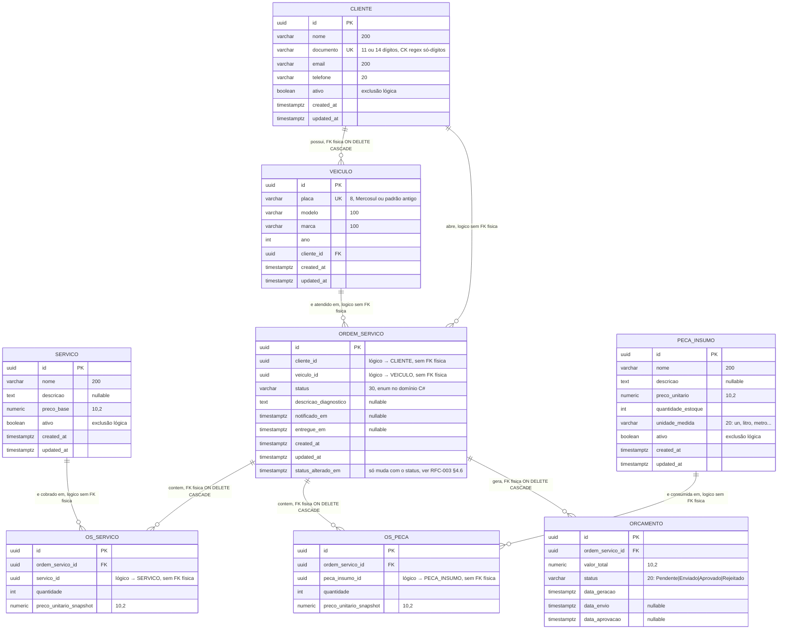

# Database Schema — Oficina Mecânica

> Schema revisado e validado contra o event storming e os requisitos do Tech Challenge.
> Fonte de verdade para as migrations EF Core de cada módulo.

---

## Regra de FK entre schemas

| Situação | FK? | Motivo |
|---|---|---|
| Tabelas no **mesmo schema** (mesmo BC) | ✅ Sim | Mesma unidade transacional, banco pode validar integridade |
| Tabelas em **schemas diferentes** (BCs diferentes) | ❌ Não | Simula isolamento de microsserviços; validação fica na Application via ACL |

Exemplos concretos:
- `cadastro.veiculo.cliente_id` → `cadastro.cliente.id` — **tem FK** (mesmo BC)
- `ordem_servico.ordem_servico.cliente_id` → `cadastro.cliente.id` — **sem FK** (BCs distintos)

---

## Schema `cadastro`

```sql
CREATE SCHEMA cadastro;

CREATE TABLE cadastro.cliente (
    id          UUID PRIMARY KEY,
    nome        VARCHAR(200)  NOT NULL,
    documento   VARCHAR(14)   NOT NULL UNIQUE, -- CPF (11 dígitos) ou CNPJ (14 dígitos), só dígitos
    email       VARCHAR(200)  NOT NULL,
    telefone    VARCHAR(20)   NOT NULL,
    ativo       BOOLEAN       NOT NULL DEFAULT TRUE, -- exclusão lógica, ver RFC-003 §4.5
    created_at  TIMESTAMPTZ   NOT NULL,
    updated_at  TIMESTAMPTZ   NOT NULL,
    CONSTRAINT CK_cliente_documento_digits CHECK (documento ~ '^[0-9]+$') -- ver RFC-003 §4.4
);

CREATE TABLE cadastro.veiculo (
    id          UUID PRIMARY KEY,
    placa       VARCHAR(8)    NOT NULL UNIQUE, -- Mercosul (ABC1D23) ou padrão antigo (ABC-1234)
    modelo      VARCHAR(100)  NOT NULL,
    marca       VARCHAR(100)  NOT NULL,
    ano         INTEGER       NOT NULL,
    cliente_id  UUID          NOT NULL REFERENCES cadastro.cliente(id) ON DELETE CASCADE, -- FK intra-schema
    created_at  TIMESTAMPTZ   NOT NULL,
    updated_at  TIMESTAMPTZ   NOT NULL
);

CREATE TABLE cadastro.servico (
    id          UUID PRIMARY KEY,
    nome        VARCHAR(200)  NOT NULL,
    descricao   TEXT,
    preco_base  NUMERIC(10,2) NOT NULL,
    ativo       BOOLEAN       NOT NULL DEFAULT TRUE, -- exclusão lógica, ver RFC-003 §4.5
    created_at  TIMESTAMPTZ   NOT NULL,
    updated_at  TIMESTAMPTZ   NOT NULL
);
```

> **Correção:** a coluna `veiculo.ano` estava documentada aqui como `SMALLINT`; o código
> (`VeiculoRecord.Ano`, `int`) e a migration (`type: "integer"`) usam `INTEGER`. Corrigido nesta
> revisão — ver descrição do PR.

---

## Schema `ordem_servico`

```sql
CREATE SCHEMA ordem_servico;

CREATE TABLE ordem_servico.ordem_servico (
    id                      UUID PRIMARY KEY,
    cliente_id              UUID          NOT NULL, -- sem FK: referência cross-schema para cadastro.cliente
    veiculo_id              UUID          NOT NULL, -- sem FK: referência cross-schema para cadastro.veiculo
    status                  VARCHAR(30)   NOT NULL, -- ver enum abaixo
    descricao_diagnostico   TEXT,                  -- preenchido no CMD RegistrarDiagnostico
    notificado_em           TIMESTAMPTZ,            -- preenchido no CMD NotificarCliente
    entregue_em             TIMESTAMPTZ,            -- preenchido no CMD ConcluirOS
    created_at              TIMESTAMPTZ   NOT NULL,
    updated_at              TIMESTAMPTZ   NOT NULL,
    status_alterado_em      TIMESTAMPTZ   NOT NULL  -- só muda nos métodos que mudam `status`; ver RFC-003 §4.6
);

-- Enum de status da OS (mantido como VARCHAR no banco; tipado como enum no domínio C#)
-- Recebida → EmDiagnostico → OrcamentoPendente → OrcamentoEnviado
-- → OrcamentoAprovado → EmExecucao → Finalizada → Entregue

CREATE TABLE ordem_servico.os_servico (
    id                       UUID PRIMARY KEY,
    ordem_servico_id         UUID          NOT NULL REFERENCES ordem_servico.ordem_servico(id) ON DELETE CASCADE,
    servico_id               UUID          NOT NULL, -- sem FK: referência cross-schema para cadastro.servico
    quantidade               INTEGER       NOT NULL,
    preco_unitario_snapshot  NUMERIC(10,2) NOT NULL  -- snapshot do preco_base no momento do diagnóstico
);

CREATE TABLE ordem_servico.os_peca (
    id                       UUID PRIMARY KEY,
    ordem_servico_id         UUID          NOT NULL REFERENCES ordem_servico.ordem_servico(id) ON DELETE CASCADE,
    peca_insumo_id           UUID          NOT NULL, -- sem FK: referência cross-schema para pecas_insumos.peca_insumo
    quantidade               INTEGER       NOT NULL,
    preco_unitario_snapshot  NUMERIC(10,2) NOT NULL  -- snapshot do preco_unitario no momento da vinculação
);

CREATE TABLE ordem_servico.orcamento (
    id                UUID PRIMARY KEY,
    ordem_servico_id  UUID          NOT NULL REFERENCES ordem_servico.ordem_servico(id) ON DELETE CASCADE,
    valor_total       NUMERIC(10,2) NOT NULL,
    status            VARCHAR(20)   NOT NULL, -- Pendente | Enviado | Aprovado | Rejeitado
    data_geracao      TIMESTAMPTZ   NOT NULL,
    data_envio        TIMESTAMPTZ,
    data_aprovacao    TIMESTAMPTZ
);
```

> Todas as FKs intra-schema acima (`veiculo.cliente_id`, `os_servico.ordem_servico_id`,
> `os_peca.ordem_servico_id`, `orcamento.ordem_servico_id`) usam `ON DELETE CASCADE` — ajuste de
> consistência detalhado em [RFC-003 §4.2](rfcs/003-escolha-do-banco-de-dados.md#42-fks-intra-schema-com-on-delete-cascade).

### Por que não há `orcamento_item`

O orçamento é calculado a partir de `os_servico` e `os_peca`, que já carregam o snapshot de preço do momento em que os itens foram adicionados. O `orcamento` armazena apenas o total e o ciclo de aprovação. Criar uma terceira cópia dos itens seria duplicação sem valor para o MVP.

Se no futuro o orçamento precisar de itens com desconto manual ou ajuste de preço, `orcamento_item` pode ser introduzido sem quebrar o schema existente.

---

## Schema `pecas_insumos`

```sql
CREATE SCHEMA pecas_insumos;

CREATE TABLE pecas_insumos.peca_insumo (
    id                  UUID PRIMARY KEY,
    nome                VARCHAR(200)  NOT NULL,
    descricao           TEXT,
    preco_unitario      NUMERIC(10,2) NOT NULL,
    quantidade_estoque  INTEGER       NOT NULL DEFAULT 0,
    unidade_medida      VARCHAR(20)   NOT NULL, -- ex.: "un", "litro", "metro"
    ativo               BOOLEAN       NOT NULL DEFAULT TRUE, -- exclusão lógica, ver RFC-003 §4.5
    created_at          TIMESTAMPTZ   NOT NULL,
    updated_at          TIMESTAMPTZ   NOT NULL
);
```

---

## Diagrama Entidade-Relacionamento

> Justificativa da escolha do PostgreSQL e ajustes de consistência/desempenho: ver
> [RFC-003](rfcs/003-escolha-do-banco-de-dados.md).

As 8 tabelas dos três schemas cabem em um único diagrama legível. Os atributos usam os tipos reais
das migrations (`uuid`, `varchar`, `text`, `numeric`, `boolean`, `timestamptz`, `int`), com o
tamanho/precisão indicado em comentário quando existe. `PK` marca chave primária, `FK` marca chave
estrangeira **física** (só existe intra-schema), e `UK` marca índice único.



**Legenda — relacionamento físico vs. lógico**

- **FK física** (`veiculo.cliente_id`, `os_servico.ordem_servico_id`, `os_peca.ordem_servico_id`,
  `orcamento.ordem_servico_id`): as duas tabelas moram no mesmo schema/bounded context, o banco
  valida a integridade e recusa um insert órfão.
- **Lógico, sem FK física** (as quatro setas restantes, todas cruzando `CLIENTE`/`VEICULO`/`SERVICO`
  do schema `cadastro` ou `PECA_INSUMO` do schema `pecas_insumos` para dentro de `ordem_servico`):
  o relacionamento existe no domínio, mas as tabelas moram em schemas diferentes e a
  [regra de FK entre schemas](#regra-de-fk-entre-schemas) proíbe a FK física entre eles. A
  integridade dessas quatro referências é garantida pela **Application**, não pelo banco — ver
  [RFC-003 §4.1](rfcs/003-escolha-do-banco-de-dados.md#41-um-schema-por-bounded-context-sem-fk-entre-schemas).

### Relacionamentos, em prosa

| Relacionamento | Cardinalidade | Significado no domínio | Integridade garantida por |
|---|---|---|---|
| `CLIENTE` → `VEICULO` | 1 cliente : N veículos | Um cliente pode ter mais de um veículo cadastrado | Banco (FK física, `ON DELETE CASCADE`) |
| `ORDEM_SERVICO` → `OS_SERVICO` | 1 OS : N itens de serviço | Os serviços orçados/executados numa OS | Banco (FK física, `ON DELETE CASCADE`) |
| `ORDEM_SERVICO` → `OS_PECA` | 1 OS : N itens de peça | As peças vinculadas a uma OS durante o diagnóstico | Banco (FK física, `ON DELETE CASCADE`) |
| `ORDEM_SERVICO` → `ORCAMENTO` | 1 OS : N orçamentos | O ciclo de orçamento (gerado → enviado → aprovado/rejeitado) de uma OS; mais de um pode existir se um orçamento for rejeitado e refeito | Banco (FK física, `ON DELETE CASCADE`) |
| `CLIENTE` → `ORDEM_SERVICO` | 1 cliente : N OS | O dono da ordem de serviço | Application (valida o `cliente_id` antes de aceitar `GerarOS`/`AbrirOrdemServicoCompleta`) |
| `VEICULO` → `ORDEM_SERVICO` | 1 veículo : N OS | O veículo atendido pela ordem de serviço | Application (mesmo ponto de validação acima) |
| `SERVICO` → `OS_SERVICO` | 1 serviço do catálogo : N itens de OS | Qual serviço do catálogo foi cobrado, com preço snapshot no momento do diagnóstico | Application (o handler resolve o `servico_id` no catálogo antes de gravar o item) |
| `PECA_INSUMO` → `OS_PECA` | 1 peça/insumo : N itens de OS | Qual peça do estoque foi consumida, com preço snapshot no momento da vinculação | Application (o fluxo cross-contexto de vinculação de peça, ver [event-storming.md](event-storming.md#fluxos-cross-contexto), decrementa o estoque e resolve o `peca_insumo_id`) |

---

## Rastreabilidade: event storming → coluna

| Evento do event storming | Onde fica no banco |
|---|---|
| OS Criada | `ordem_servico` INSERT com `status = Recebida` |
| Diagnóstico Iniciado | `status = EmDiagnostico` |
| Análise Realizada e Peças Identificadas | `descricao_diagnostico` preenchido + registros em `os_servico`/`os_peca` |
| Estoque Atualizado | `peca_insumo.quantidade_estoque` decrementado |
| Orçamento Gerado | INSERT em `orcamento` com `status = Pendente`, `valor_total` calculado |
| Orçamento Enviado | `orcamento.status = Enviado`, `data_envio` preenchido |
| Orçamento Aprovado | `orcamento.status = Aprovado`, `data_aprovacao` preenchido |
| OS em Execução | `ordem_servico.status = EmExecucao` |
| OS Finalizada | `ordem_servico.status = Finalizada` |
| Cliente Notificado | `ordem_servico.notificado_em` preenchido |
| OS Entregue | `ordem_servico.status = Entregue`, `entregue_em` preenchido |

---

## Resumo de tabelas por schema

| Schema | Tabelas | Observação |
|---|---|---|
| `cadastro` | `cliente`, `veiculo`, `servico` | FK intra-schema: `veiculo.cliente_id → cliente.id`, `ON DELETE CASCADE` |
| `ordem_servico` | `ordem_servico`, `os_servico`, `os_peca`, `orcamento` | FKs intra-schema das três tabelas filhas para `ordem_servico`, todas `ON DELETE CASCADE`; referências cross-schema só por uuid, sem FK |
| `pecas_insumos` | `peca_insumo` | Sem dependências internas |
