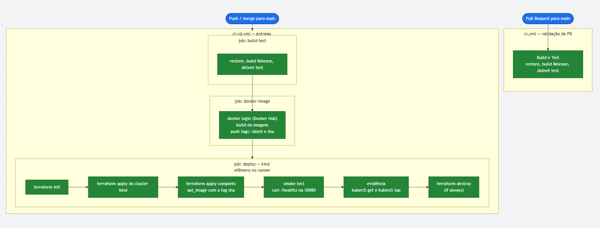
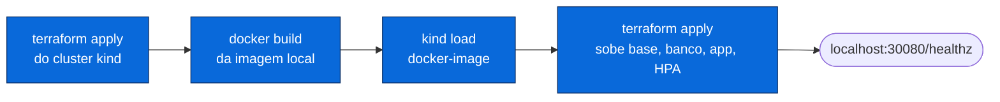

# Desenho — Fluxo de Deploy (CI/CD)

> Pipeline de integração e entrega contínua no **GitHub Actions**. O cluster kind é criado
> **efêmero dentro do runner** GitHub-hosted, a cada push na `main`: build → teste → imagem →
> deploy → smoke test → destroy. O histórico do Actions fica autocontido.
>
> Workflows: [`../../../.github/workflows/ci.yml`](../../../.github/workflows/ci.yml) (PRs) e
> [`../../../.github/workflows/ci-cd.yml`](../../../.github/workflows/ci-cd.yml) (push na `main`).
> Plano em [`../../planos/infra-fase-2/04-cicd.md`](../../planos/infra-fase-2/04-cicd.md).

---

## Pipeline por gatilho

---

## Etapas do `ci-cd.yml`

| Job | Depende de | O que faz |
|---|---|---|
| **build-test** | — | `dotnet restore/build --configuration Release` + `dotnet test` |
| **docker-image** | build-test | login no Docker Hub, `docker build` a partir da raiz, push das tags `latest` e `${{ github.sha }}` |
| **deploy** | docker-image | `terraform init` → apply do cluster kind → apply completo com `api_image=<sha>` → **smoke test** em `/healthz` (NodePort 30080) → coleta de evidência (`kubectl get/top`) → `terraform destroy` (sempre) |

**Segredos usados:** `DOCKERHUB_USERNAME`, `DOCKERHUB_TOKEN`.

---

## Deploy local (para desenvolvimento / demonstração)

Fora do CI, o cluster é **persistente** e a imagem é carregada direto no kind (sem Docker Hub).
O primeiro apply é em dois passos por causa do `kind load`:

> Passo a passo completo (local e CI) em [`../../../infra/README.md`](../../../infra/README.md).
> Demonstração de escalabilidade automática (teste de carga → HPA escala): ver o vídeo
> referenciado no [README principal](../../../README.md).
