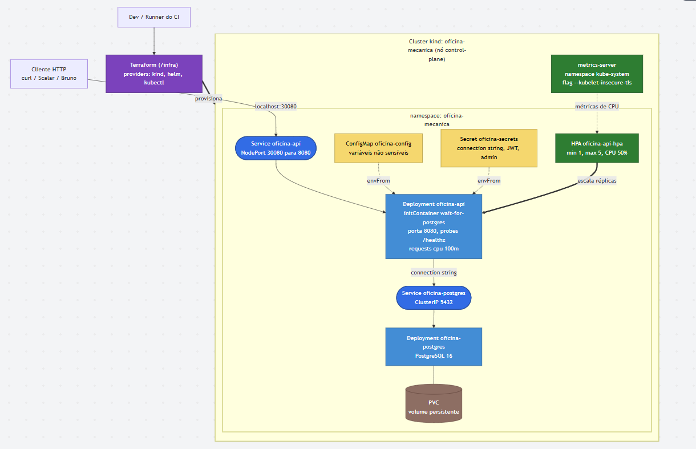

# Desenho — Infraestrutura Provisionada

> Desenho de solução da infraestrutura da **Fase 2**. O cluster Kubernetes é **local (kind)**,
> provisionado 100% por **Terraform** com _resources_ de verdade (`kind_cluster`, `helm_release`,
> `kubectl_manifest`) — sem `local-exec`. O banco PostgreSQL roda **dentro do cluster**.
>
> Decisão registrada em [`../../planos/infra-fase-2/00-visao-geral.md`](../../planos/infra-fase-2/00-visao-geral.md);
> recursos e passo a passo em [`../../../infra/README.md`](../../../infra/README.md).

---

## Visão geral do cluster

---

## Recursos provisionados pelo Terraform

| Recurso Terraform | Tipo | O que cria |
|---|---|---|
| `kind_cluster.this` | `kind_cluster` | Cluster kind com NodePort 30080 mapeado para `localhost:30080` |
| `helm_release.metrics_server` | `helm_release` | metrics-server em `kube-system` (habilita o HPA) |
| `kubectl_manifest.namespace` | `kubectl_manifest` | Namespace `oficina-mecanica` |
| `kubectl_manifest.configmap` | `kubectl_manifest` | ConfigMap com variáveis **não** sensíveis |
| `kubectl_manifest.secret` | `kubectl_manifest` | Secret com credenciais do banco/JWT |
| `kubectl_manifest.postgres_pvc` | `kubectl_manifest` | PersistentVolumeClaim do PostgreSQL |
| `kubectl_manifest.postgres_deployment` | `kubectl_manifest` | Deployment do PostgreSQL 16 |
| `kubectl_manifest.postgres_service` | `kubectl_manifest` | Service ClusterIP do PostgreSQL |
| `kubectl_manifest.api_deployment` | `kubectl_manifest` | Deployment da API (imagem via `var.api_image`) |
| `kubectl_manifest.api_service` | `kubectl_manifest` | Service NodePort 30080 da API |
| `kubectl_manifest.api_hpa` | `kubectl_manifest` | HorizontalPodAutoscaler da API |

## Pontos de projeto que sustentam o desenho

- **HPA por CPU (50%)**, `min 1 / max 5`. Depende do `resources.requests.cpu` no container da
  API e do metrics-server — ambos presentes.
- **initContainer `wait-for-postgres`**: a API roda `MigrateAsync` no startup e falha se o banco
  não estiver pronto; o initContainer evita `CrashLoopBackOff`.
- **Credenciais consistentes**: `POSTGRES_USER/PASSWORD` do banco e `ConnectionStrings__Default`
  da API saem da **mesma** Secret.
- **Imagem no cluster**: local via `kind load docker-image` · CI via Docker Hub público
  (`imagePullPolicy: IfNotPresent`).

> Escalabilidade automática demonstrada por teste de carga (o HPA sobe as réplicas da API).
> Ver [`fluxo-deploy.md`](fluxo-deploy.md) e [`../../../infra/README.md`](../../../infra/README.md).
