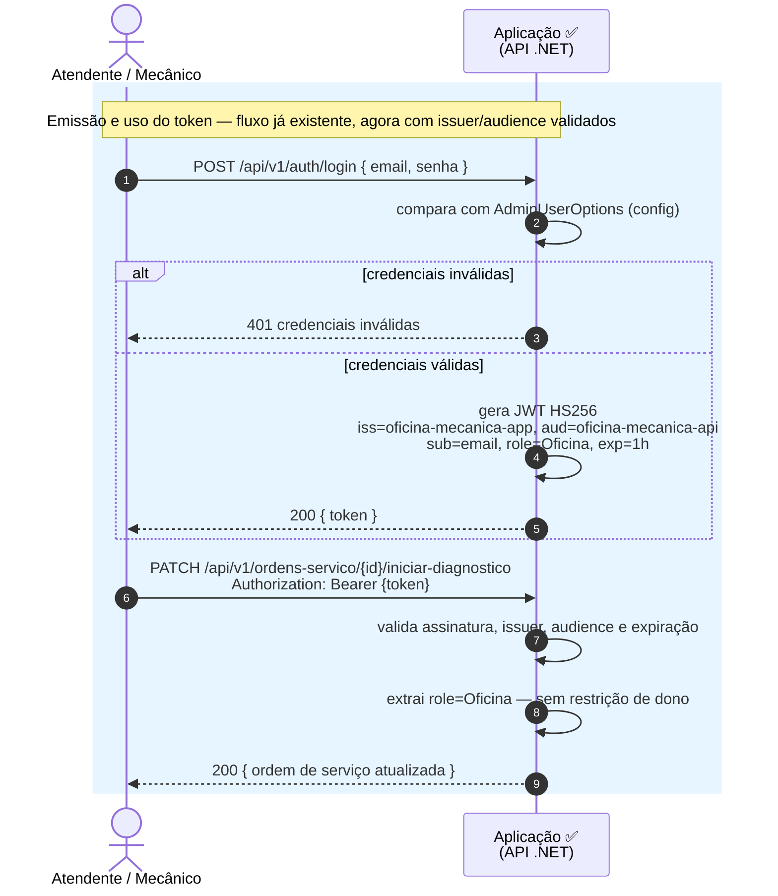

# Desenho — Sequência de Autenticação

> Diagrama de sequência dos dois fluxos de autenticação da **Fase 3**: cliente por CPF e oficina
> por email/senha. Diagrama em [Mermaid](https://mermaid.js.org/) — renderiza nativamente no
> GitHub.
>
> Fonte de verdade: [RFC-001 — Estratégia de autenticação](../rfcs/001-estrategia-de-autenticacao.md)
> (contrato de claims em §4.1, mapa de rotas por papel em §4.2), com as decisões detalhadas em
> [ADR-001](../adrs/001-jwt-hs256-segredo-compartilhado.md),
> [ADR-002](../adrs/002-lambda-le-o-banco-diretamente.md) e
> [ADR-003](../adrs/003-dois-emissores-e-autorizacao-por-papel.md).

---

## O que está implementado e o que é alvo

Este diagrama mistura três componentes em estágios de entrega diferentes. Para não prometer um
fluxo ponta a ponta que ainda não existe, cada participante e cada mensagem estão marcados:

| Marcação | Significado |
|---|---|
| ✅ **Implementado** | Roda hoje neste repositório (aplicação) |
| 🧪 **Implementado, não publicado** | Existe com testes no repositório `oficina-mecanica-lambda-auth`, mas o deploy depende de infraestrutura de nuvem ainda não provisionada |
| 🎯 **Alvo** | Não existe ainda — é escopo da fase de infraestrutura |

- **Aplicação** (validação dos dois tokens, autorização por papel, restrição de dono da OS): ✅
  implementado e em produção neste repositório.
- **Function Serverless** de autenticação por CPF: 🧪 implementada e testada no repositório
  `oficina-mecanica-lambda-auth`, mas ainda não publicada — o deploy depende da conta AWS.
- **API Gateway**: 🎯 alvo. Não existe hoje; é o componente que a fase de infraestrutura ainda vai
  provisionar (RFC-001 §1 e §5).

O fluxo da oficina (email/senha) é o único dos dois que roda de ponta a ponta hoje, porque não
depende de nenhum componente externo.

---

## Fluxo 1 — Cliente autentica por CPF

```mermaid
sequenceDiagram
    autonumber
    actor Cliente
    participant GW as API Gateway 🎯 (alvo)
    participant Lambda as Function Serverless 🧪<br/>(implementada, não publicada)
    participant DB as PostgreSQL<br/>cadastro.cliente
    participant App as Aplicação ✅<br/>(API .NET)

    rect rgb(255, 245, 230)
        note over Cliente,DB: Emissão do token — Lambda ainda não publicada; Gateway ainda não existe
        Cliente->>GW: POST /auth/cpf { cpf }
        GW->>Lambda: encaminha requisição
        Lambda->>Lambda: valida formato e dígitos verificadores do CPF

        alt CPF malformado
            Lambda-->>GW: 400 cpf_invalido
            GW-->>Cliente: 400 cpf_invalido
        else CPF com formato válido
            Lambda->>DB: SELECT id, documento, ativo<br/>FROM cadastro.cliente WHERE documento = :cpf
            DB-->>Lambda: linha encontrada ou nada

            alt cliente inexistente OU cliente inativo
                note over Lambda: mesma resposta genérica nos dois casos —<br/>decisão deliberada (RFC-001, ADR-002)
                Lambda-->>GW: 401 nao_autenticado
                GW-->>Cliente: 401 nao_autenticado
            else cliente existe e está ativo
                Lambda->>Lambda: gera JWT HS256<br/>iss=oficina-mecanica-auth, aud=oficina-mecanica-api<br/>sub=id do cliente, role=Cliente, cpf, exp=1h
                Lambda-->>GW: 200 { token, expiresIn }
                GW-->>Cliente: 200 { token, expiresIn }
            end
        end
    end

    rect rgb(230, 245, 255)
        note over Cliente,App: Uso do token — roda hoje, contra a aplicação publicada
        Cliente->>App: GET /api/v1/ordens-servico/acompanhamento<br/>Authorization: Bearer {token}
        App->>App: valida assinatura (segredo compartilhado),<br/>issuer, audience e expiração
        App->>App: extrai role=Cliente e sub (id do cliente) das claims
        App->>App: filtra ordens de serviço pelo sub do token<br/>(cliente só vê as próprias OS)
        App-->>Cliente: 200 { ordens de serviço do cliente }
    end
```

### Passo a passo e decisões

1–3. O cliente informa o CPF a um API Gateway que, na topologia alvo, roteia a chamada até a
Function Serverless (RFC-001 §1). Hoje esse salto não existe fisicamente: nem o Gateway está
provisionado, nem a Lambda está publicada — o comportamento descrito é o que o código da Lambda
implementa e testa localmente.

4–5. A Lambda valida o CPF (formato e dígitos verificadores) antes de tocar o banco. CPF malformado
responde **400** sem nenhuma consulta — não há como uma consulta com um documento inválido revelar
informação sobre cadastro.

6–9. Com CPF válido, a Lambda faz uma consulta direta a `cadastro.cliente`, com um usuário de banco
dedicado e restrito a `SELECT`. Essa é a decisão de [ADR-002](../adrs/002-lambda-le-o-banco-diretamente.md):
ler o schema de outro bounded context é uma exceção deliberada ao isolamento entre contextos que o
projeto defende desde a Fase 2, aceita para não criar dependência circular entre o autenticador e o
serviço que ele protege, e para não derrubar o login quando a aplicação estiver fora do ar.

10–12. **Cliente inexistente e cliente inativo geram a mesma resposta — 401 genérico.** Essa
igualdade é intencional, conforme o comentário de intenção no próprio `AuthenticationService` da
Lambda: se as respostas fossem diferentes, o endpoint de login vazaria se um CPF está cadastrado,
virando um verificador de cadastro de terceiros.

13–15. Com cliente ativo, a Lambda assina o JWT em HS256 com o segredo compartilhado com a
aplicação — decisão de [ADR-001](../adrs/001-jwt-hs256-segredo-compartilhado.md), motivada por
manter a mudança mínima (a aplicação já valida HS256) e por reduzir a dependência de recursos ainda
não explorados da conta AWS Academy disponível. O preço dessa escolha é abrir mão do *JWT
authorizer* nativo do API Gateway, que exige um emissor OIDC; a validação fica inteiramente na
aplicação. As claims seguem o contrato do RFC-001 §4.1: `sub` é o id do cliente, `role=Cliente`,
mais a claim `cpf`.

16–19. Do lado da aplicação — a parte que roda de fato hoje —, o token chega como `Bearer` numa
rota protegida. A aplicação valida assinatura, `issuer` e `audience` (esses dois últimos estavam
desligados até a Fase 2, ligados agora por decisão do ADR-001), extrai `role` e `sub`, e usa o `sub`
para filtrar as ordens de serviço: um cliente autenticado só enxerga as próprias OS
(`ClaimsPrincipalExtensions.ObterClienteIdDoSolicitante`, comparado contra o dono da OS nos
handlers de `ordens-servico`). Essa comparação é a regra adicional do RFC-001 §4.2 — sem ela, a
separação por papel protegeria o estoque, mas não protegeria um cliente do outro. Quando a
comparação falha, a aplicação responde **403** (`OrdemServicoErrors.AcessoNegado`), não 404 — a OS
existe, só não pertence a quem pediu.

---

## Fluxo 2 — Oficina autentica por email e senha



### Passo a passo e decisões

Este é o fluxo que já existia antes da Fase 3 (login com o usuário administrador vindo de
configuração — fora de escopo desta fase trocar por múltiplos usuários, RFC-001 §6); o que muda
agora é a validação de `issuer`/`audience`, ligada em `AuthenticationExtensions`, e a claim
`role=Oficina` no token, que só passa a existir com a introdução do papel `Cliente`
([ADR-003](../adrs/003-dois-emissores-e-autorizacao-por-papel.md)). Sem essa claim, autorizar por
papel não teria como diferenciar os dois tokens.

O token da oficina usa `iss=oficina-mecanica-app` — distinto do `iss=oficina-mecanica-auth` da
Lambda — para que a aplicação aceite os dois emissores sem confundir um com o outro
(`ValidIssuers` com dois valores, mesmo segredo). O `sub` aqui é o email do usuário, não um id,
porque não existe hoje um cadastro de usuários da oficina — só o administrador de configuração.

Rotas de `ordens-servico` fora de acompanhamento/aprovação/rejeição, e todas as rotas de
`clientes`, `veiculos`, `servicos` e `pecas-insumos`, exigem `role=Oficina` e **não** têm restrição
de dono — a oficina opera sobre qualquer cliente e qualquer OS, o que reflete o próprio domínio
(RFC-001 §4.2).

---

## Onde os dois papéis se distinguem

O ponto de bifurcação é sempre o mesmo, dentro da aplicação: o middleware de autenticação (JWT
Bearer) valida a assinatura, o `issuer` e a `audience` de forma idêntica para os dois emissores —
a diferença está só em qual `issuer` bateu — e a claim `role`, lida via `RoleClaimType = "role"`,
decide qual `[Authorize(Roles = ...)]` a rota exige. Rotas com `Roles = "Cliente,Oficina"` (como
`GET /ordens-servico/{id}` e `/{id}/status`) aceitam os dois papéis, mas só o papel `Cliente`
carrega a restrição adicional de dono, aplicada explicitamente nos handlers de aplicação
(`AprovarOrcamentoHandler`, `RejeitarOrcamentoHandler`, `ObterOrdemServicoPorIdHandler`) comparando
`sub` com o `ClienteId` da ordem de serviço — nunca no controller, para manter a regra de negócio
na camada de Application.

---

## Por que dois emissores em vez de um só

A alternativa mais simples — um único fluxo, papel vindo de uma coluna no banco — foi descartada
porque, no fluxo por CPF, não existe segredo: o CPF é um identificador público, e qualquer papel
que dependesse só dele para conceder acesso administrativo trocaria uma falha de segurança por
outra pior. A análise completa das alternativas e por que a spec não é atendida com "tudo por CPF"
está em [ADR-003](../adrs/003-dois-emissores-e-autorizacao-por-papel.md).
